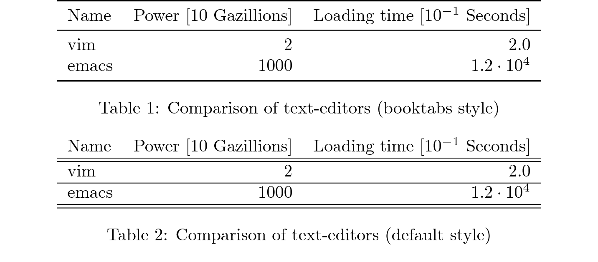

# Generate LaTex (data) tables from Node

This package generates LaTex-Tables in different styles
from within a node application. 

## Features

- Different table styles:
    - `booktabs`: Pretty booktabs table
	- `default`: Standard Latex table using double lines
	- `ascii`: Text table with the clui package. Useful to get a preview of your table before compiling it to LaTeX. Ascii table columns can be configured to do simple test-wrapping.
- __Number formatting__: 
   - You can specify units and decimal scalings for each table column. Column values are then scaled automatically and units and scaling factors are shown in the table header.
   - Format numbers in the table body by precision or number of decimal places
   - Scientific notations are automatically converted to math (5e+5 -> $ 5\cdot 10^{5}$)
- Commenting
   - A latex-comment can be added to each table row. Body comments are added  after the line, a header comment is
   added above the header line.
   
   
## Installation

Install directly from this repository:

````
npm install i4h/latex-data-table
````
      
## Examples

### A Simple Table

Quickly generate a table by specifying an array with the header contents
and a matrix with the body contents:
````
var LatexTable = require('latex-data-table');

var header = ["Column1", "Column2"];
var body = [[1,"a"],[2,"b"]];
/* Generate latex code */
var latex = LatexTable(body, header);
````
The generated table will look like this:


Check `examples/simple_latex.*` to find the full example and the generated latex.


### A Data Table

The example in `examples/showcase_latex` demonstrates how to actually show and format some data. 
Options for individual columns are defined in the header:

````
var LatexTable = require('latex-data-table');

var options = {
	style = 'booktabs'
	caption = '...',
	label = '...',
};

var header = {
    comment: "header comment" ,
    cells:
        [
            {
                content: 'Name',
                spec: "l"},
            {
                content: 'Power',
                spec: "r",
                decimalScaling: "1",
                units: "Gazillions",
                formatter: {decimals: 0}
            },
            {
                content: 'Loading time',
                spec: "r",
                decimalScaling: "-1",
                units: "Seconds",
                formatter: {precision: 2}
            },
        ]
};

var body = [
    {
        comment: "first line comment",
        cells: ['vim', '15', 0.2]
    },
    {
        comment: "second line comment",
        cells: ['emacs', '10000', 1234]
    },
];

/* Generate latex code */
var result = LatexTable(body, header);

````

The generated table in  default and booktab styling will look like this:  




To output your table to the console for a preview, use the ascii style. Column width can be
controlled manually by setting the `colWidth` property on the corresponding column. 

````
  Name      Power [10 Gazillions]              Loading time [10^{-1} Seconds]     
  --------------------------------------------------------------------------------
  vim       2                                  2.0                                 #first line comment
  emacs     1000                               1.2e+4                              #second line comment
````


